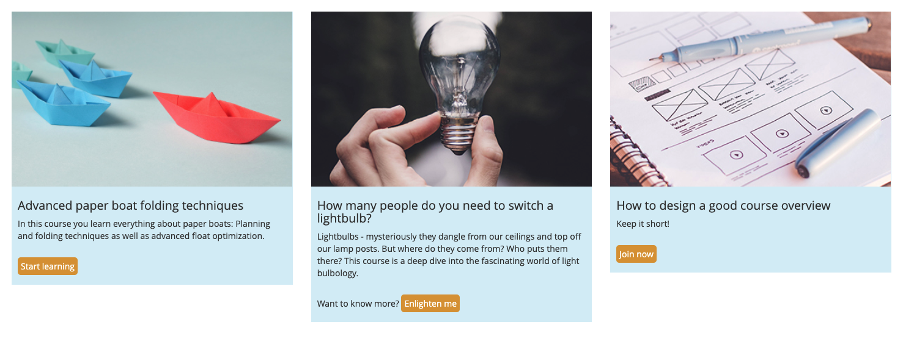
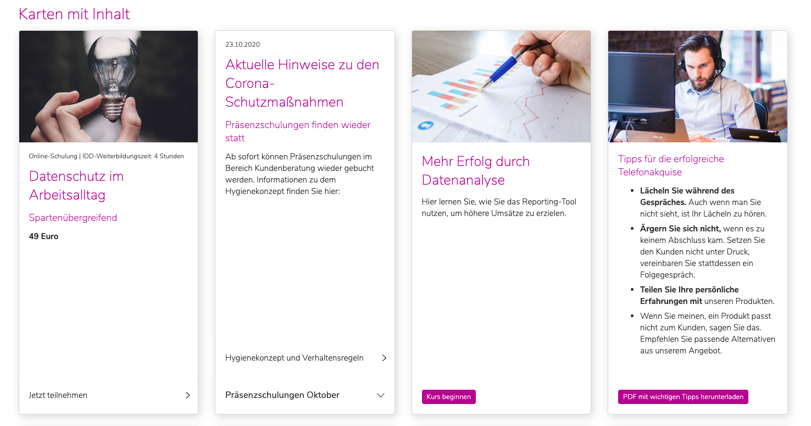
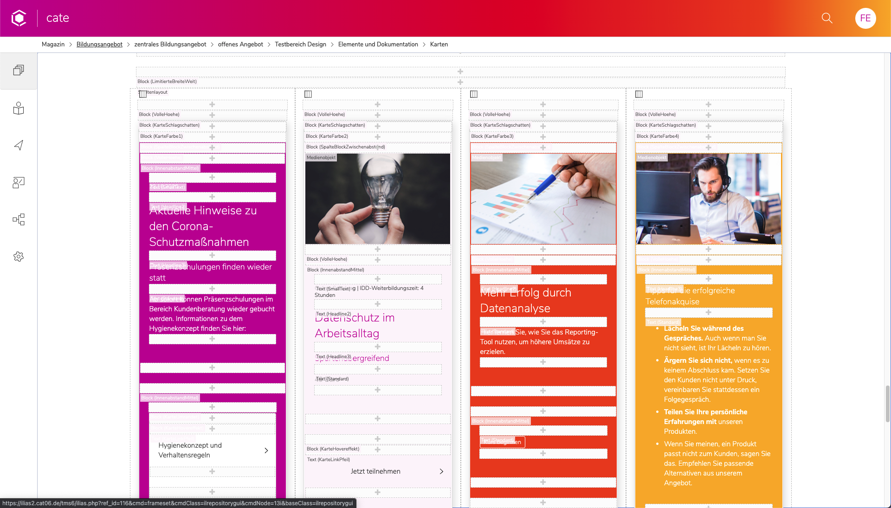
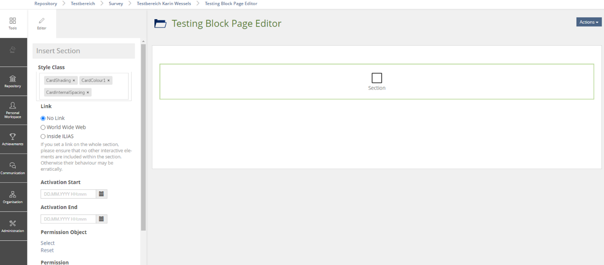

# Content Styles

Creating designed elements to guide attention

for a better UX

---

Christoph Krahl

Linda Dierke

Ferdinand Engländer

#### UX Designers @ Concepts and Training GmbH

---

Concepts and Training = CaT

offers ILIAS-based training management solution for businesses (insurances, car dealers)

---

## Client feedback

---

As content grows:

---

Navigation, lists, breadcrumbs and dashboards get overwhelming

---

User feels lost

---

## The challenge

---

We need to guide the user through categories and content

---

filter and reduce input

maximize overview

---

public pages need to look on brand

---

## Design teams perspective

---

Skin design

---


---


---


---


---

Tools for designing content

---

<video controls muted autoplay>
    <source data-src="vids/cate_learning-module.mp4" type="video/mp4" />
</video>

---

### Content styles

usually used for small visual changes of page editor elements

---

<video controls muted autoplay>
    <source data-src="vids/standard-content-style.mp4" type="video/mp4" />
</video>

---

text, border, background color

---

Complex magazine layouts are possible with column layout

---

Let's use the page editor

---

and instead of building content pages

---

let's create a toolbox

for creating home and overview pages

---

so admins can create custom simplified navigations

---

and help users find their way

---

<video controls muted autoplay>
    <source data-src="vids/cate_4-image-tiles-menu.mp4" type="video/mp4" />
</video>

---

<video controls muted autoplay>
    <source data-src="vids/cate_banner-and-accordion.mp4" type="video/mp4" />
</video>

---

Content styles offer many possibilities beyond just changing a text color.

---

## Let's dive in

---

### Building a course card:

Card with an image, description text and call to action button

---



---

* Possibilities and limitations of content styles {.fragment .fade-in-then-semi-out}
* How to overcome these limitations with CSS {.fragment .fade-in-then-semi-out}
* Ideas to make content building easier for designers and users {.fragment .fade-in-then-semi-out}

---

### Purpose:

Displaying a selection of courses of a sub-category {.fragment .fade-in-then-semi-out}

Recommending a course within a content body {.fragment .fade-in-then-semi-out}

---

### Step by step demonstration

1. so you can build it yourself

2. so you experience the issues

---

Content styles are created through the admin interface

Layout and Navigation > Layout > Content Styles

---

<video controls muted autoplay>
    <source data-src="vids/path-to-content-styles.mp4" type="video/mp4" />
</video>

---

### Card base

Block
* color
* margins

---

<video controls muted autoplay>
    <source data-src="vids/card-content-style-form_base.mp4" type="video/mp4" />
</video>

---

On the side

Assembling our elements inside the page editor

---

<video controls muted autoplay>
    <source data-src="vids/card-content-style-form_start-page.mp4" type="video/mp4" />
</video>

---

Adding images

---

<video controls muted autoplay>
    <source data-src="vids/card-content-form_adding-images.mp4" type="video/mp4" />
</video>

---

### Image

Media
* 100% width
* no margins

---

<video controls muted autoplay>
    <source data-src="vids/card-content-form_image-full-width.mp4" type="video/mp4" />
</video>

---

Adding a headline

---

<video controls muted autoplay>
    <source data-src="vids/card-content-form_adding-headline.mp4" type="video/mp4" />
</video>

---

### The inner padding

Block
* padding

---

<video controls muted autoplay>
    <source data-src="vids/card-content-form_padding.mp4" type="video/mp4" />
</video>

---

<video controls muted autoplay>
    <source data-src="vids/card-content-form_padding-page-editor.mp4" type="video/mp4" />
</video>

---

### The CTA button

Character
* text color
* margin
* background color

---

<video controls muted autoplay>
    <source data-src="vids/card-content-form_ButtonStyle.mp4" type="video/mp4" />
</video>

---

Adding the button

---

<video controls muted autoplay>
    <source data-src="vids/card-content-form_complete-button.mp4" type="video/mp4" />
</video>

---

Done!

---


---

### Limitations & issues

---

many, many clicks

---

long, overwhelming form

---

disjointed from the editor (on purpose)

---

no quick preview of how these elements come together

---

actually not that accessible - CSS knowledge required

---

designer (power user): frustrated and limited by the form

user (beginner): intimidated, no WYSIWYG feedback

---

very hard to do anything beyond quick changes

---

Impossible with just the form:

* certain hover states
* conditional changes (change text if it is inside certain blocks)
* complex flex-box layouts

---

## Overcoming the limitations with CSS

---

Styling the CSS instead of form parameters

---

Creating the content styles without adding any settings

---

<video controls muted autoplay>
    <source data-src="vids/CSS_create-content-styles-name.mp4" type="video/mp4" />
</video>

---

Name of the style appears in the editor dropdowns

---

<video controls muted autoplay>
    <source data-src="vids/CSS_structure-no-styling-yet.mp4" type="video/mp4" />
</video>

---

Using the Chrome Inspector for Styling

---

<video controls muted autoplay>
    <source data-src="vids/CSS_chrome-inspector.mp4" type="video/mp4" />
</video>

---

Save the LESS/CSS code

---

CSS

```CSS
.ilc_section_ContentCardBase {
    background-color: #e9f8fd;
}

.ilc_section_ContentCardPadding {
    padding: 10px;
}

.ilc_text_inline_ContentCardButtonPrimary {
    background-color: #e69e1a;
    color: white;
    padding: 10px;
    border-radius: 5px;
}

.ilc_section_ContentCardBase figure.ilc_media_cont_MediaContainer {
    margin: 0;
    width: 100%;
}
```

---

LESS

```LESS
.ilc_section_ContentCardBase {
    background-color: mix(#FFF,@brand-primary,50%);

    figure.ilc_media_cont_MediaContainer {
        margin: 0;
        width: 100%;
    }
}

.ilc_section_ContentCardPadding {
    padding: 10px;
}

.ilc_text_inline_ContentCardButtonPrimary {
    background-color: @brand-secondary;
    color: white;
    padding: 10px;
    border-radius: 5px;
}
```

---

[Official guide](https://docu.ilias.de/ilias.php?ref_id=367&obj_id=75028&cmd=layout&cmdClass=illmpresentationgui&cmdNode=iv&baseClass=ilLMPresentationGUI) on how to create a skin

---

Importing our custom-content-styles.less in our skin

```LESS
@import "less/custom-content-styles.less";
```

---

Compiling a delos.css that includes our additions

---

### Same visual result

---

designer (power user): can style to his hearts content

user (beginner): can be offered a library of helpful content styles

---

### Advantages of CSS approach

---

Settings of all elements at one glance

---

no clicking around and scrolling through a form

---

Use of less variables like @brand-primary

---

new possibilities like hover states for our "button"

---

### Issues with CSS approach

---

requires file access to the server and a custom skin setup

---

not closer to a WYSIWYG experience for the user

---

We took this further...
## Full design toolbox

---

<video controls muted autoplay>
    <source data-src="vids/cate_design-toolbox.mp4" type="video/mp4" />
</video>

---

Content cards build for Cate:



---

fancy additions:

* same height in every column
* spacing between content and CTA

---

All controlled by individual blocks

---

ended up in excessive nesting

---

Inside page editor:

One block per setting

---



---

Code of the content cards:

One div per setting is not good practice

---

<video controls muted autoplay>
    <source data-src="vids/cate_heavy-nesting-code.mp4" type="video/mp4" />
</video>

---

## Who are content styles for?

---

Defined by admins / designers

use at your own risk is "ok"

---

Used in the page editor by users

should be self explanatory and fool proof

---

How do we enpower users

to create more complex layouts

on brand without confusion?

---

## A small suggestion

---

Allow choosing multiple styles for one block

---

1. Create one block
2. Add from a selection of predefined content styles: color + padding + border + shadow

---



---

### Advantages

---

Avoids nesting chaos

---

less clicks inside page editor

---

User still only has a access to carefully selected on-brand options

---

## Outlook

CaT is looking into implementing this

---

adding to the core if it's deemed a worthy addition

---

funding, feedback, cooperation is greatly appreciated

---

<!-- .slide: data-background-iframe="https://docu.ilias.de/goto_docu_wiki_wpage_6767_1357.html" -->

---

## Vision beyond this

There are powerful page builders out there...

Wordpress: Elementor, Divi, Gutenberg

---

Get inspiration, but innovate on a small and practical level

---

Should contents styles and page editor grow closer together?

library of nested block templates?

---

Why?

Because ILIAS pages are not just a canvas for text

---

design options for pages enpower authors to

guide attention and simplify navigations

for a better user experience

---

<!-- .slide: data-background-iframe="https://docu.ilias.de/goto_docu_wiki_wpage_6767_1357.html" -->

---

Thank you :)

## Any questions?